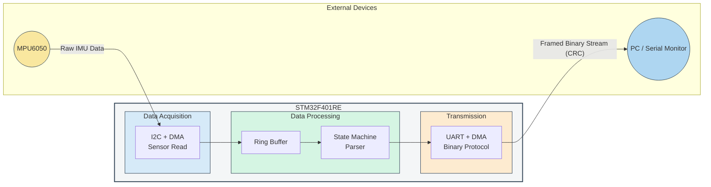

# 🛰️ STM32F401 MPU6050 DMA-UART Protocol


High-performance embedded system for **STM32F401RE (Nucleo)** interfacing with the **MPU-6050** accelerometer/gyroscope.
This project demonstrates efficient low-level hardware control using **DMA**, **interrupt-driven design**, and a **custom binary communication protocol**.

---

## 🚀 Key Technical Features

### ⚡ Non-blocking Data Acquisition

* Uses **I2C with DMA (Direct Memory Access)**
* Reads full 6-axis sensor data without CPU blocking
* Maximizes real-time performance

### 📡 Custom Binary Protocol

Reliable UART communication protocol designed from scratch:

* **Frame Synchronization**

  * Byte-stuffing for robust packet boundary detection
* **Data Integrity**

  * **CRC-32 checksum** for transmission validation

### 🔄 Asynchronous Processing

* **Ring Buffers (1024 samples)** for continuous data flow
* **State Machine Parser** for safe, non-blocking decoding
* Fully interrupt/DMA-driven pipeline

### ⏱ Precise Timing

* Hardware **TIM peripherals** used for deterministic sampling frequency
* Stable and predictable data acquisition loop

---

## 🏗 System Architecture



---

## 🛠 Tech Stack

* **Language:** Embedded C
* **Hardware:** Nucleo-F401RE (ARM Cortex-M4)
* **Peripherals:**

  * I2C
  * USART (UART)
  * DMA
  * TIM (Timers)
  * CRC Unit
* **Development Tools:**

  * STM32CubeIDE
  * STM32 HAL Library

---

## 🚦 Getting Started

### 1. Clone the repository

```bash
git clone https://github.com/maksim-kameko/stm32f401-mpu6050-dma-uart-protocol.git
```

### 2. Open project

* Launch **STM32CubeIDE**
* Import the project

### 3. Build & flash

* Compile the project
* Flash it to **Nucleo-F401RE**

### 4. Hardware connection

Connect **MPU6050** via I2C:

| MPU6050 | STM32 |
| ------- | ----- |
| VCC     | 3.3V  |
| GND     | GND   |
| SDA     | PB9   |
| SCL     | PB8   |

---

## 📊 Data Flow Overview

1. MPU6050 generates raw accelerometer & gyroscope data
2. STM32 reads data via **I2C + DMA**
3. Data stored in **ring buffer**
4. Processed by **state machine parser**
5. Packed into binary frames with **CRC-32**
6. Sent via **UART + DMA** to PC

---

## 🎯 Project Goals

* Demonstrate **zero-blocking embedded architecture**
* Showcase **efficient DMA usage**
* Build a **robust communication protocol**
* Provide a clean base for **real-time sensor systems**

---

## 📌 Future Improvements

* 📈 Add data visualization (Python / GUI)
* 🧭 Sensor fusion (Kalman / Complementary filter)
* 📦 RTOS integration (FreeRTOS)
* 📡 USB / BLE communication support

---

## 📚 Detailed Documentation
For full technical specifications, communication protocol details, and hardware configuration, please refer to the [Full Documentation (PDF)](Documentation.pdf).
